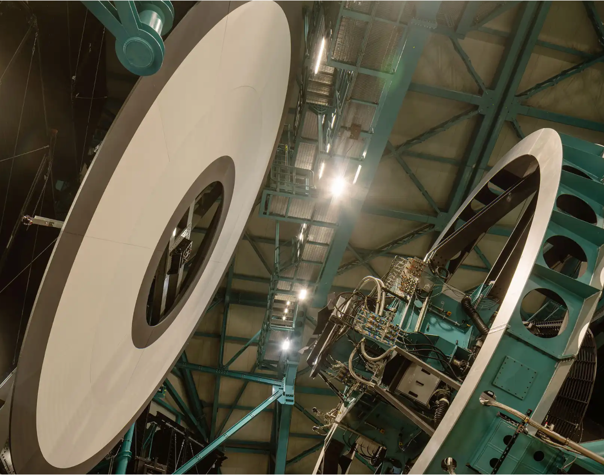
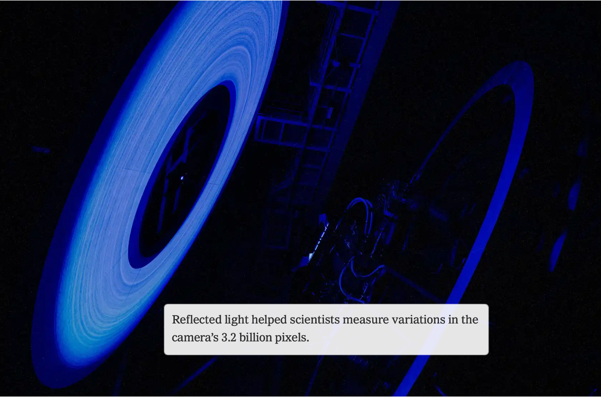
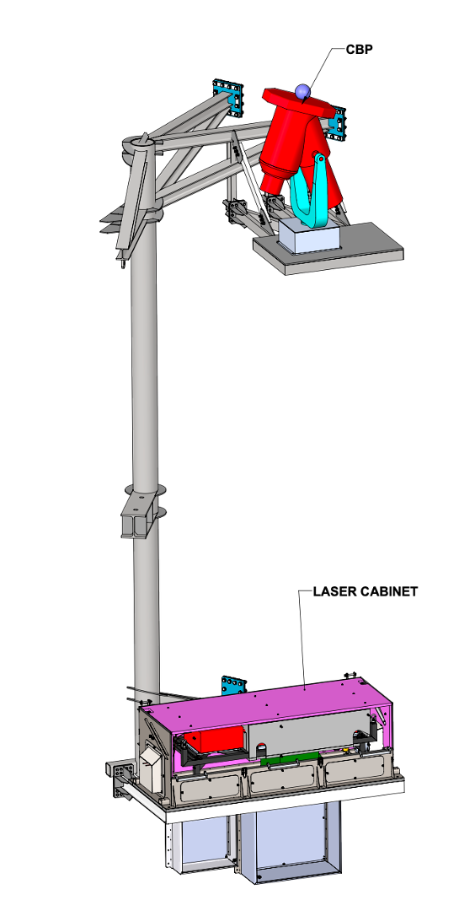
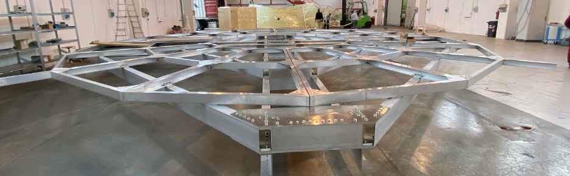
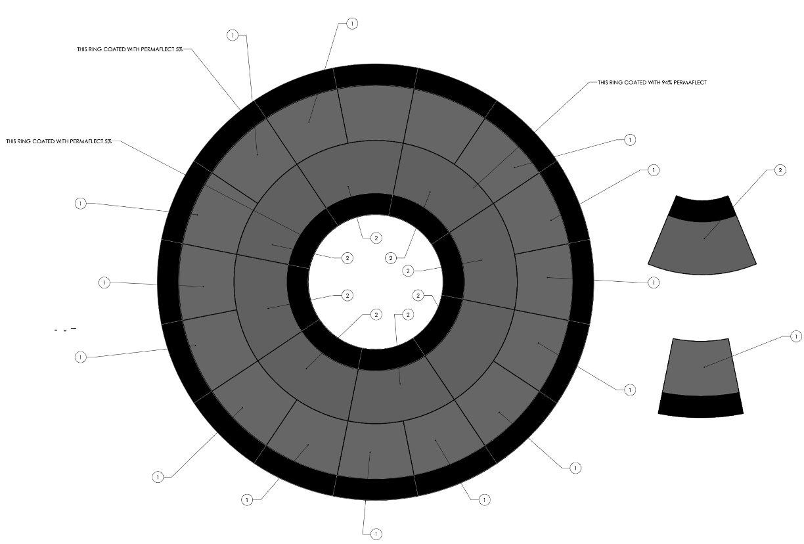
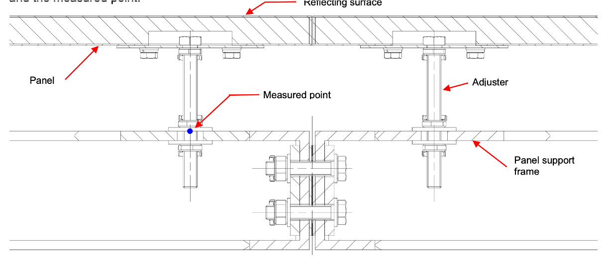
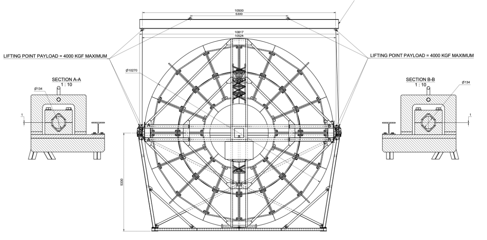
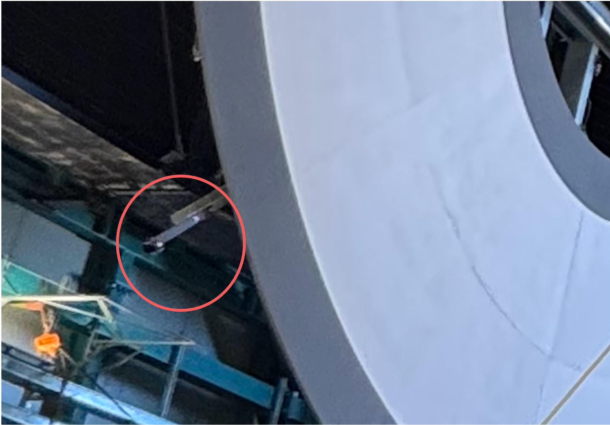
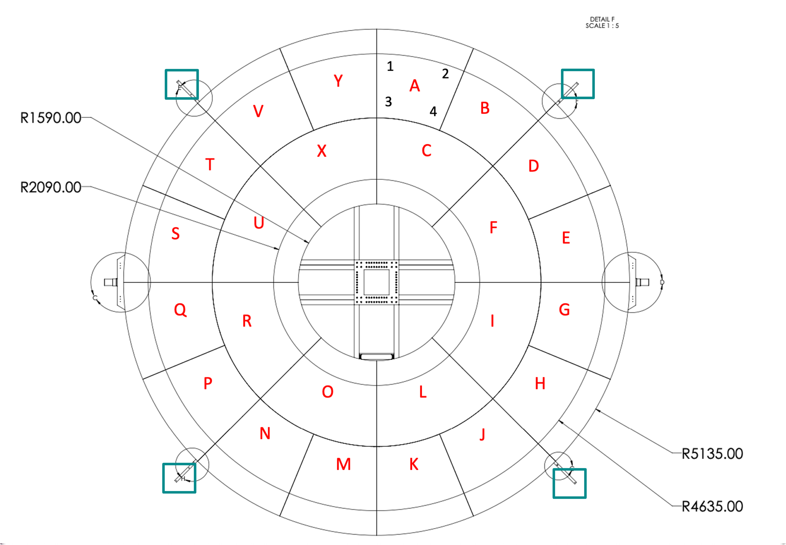
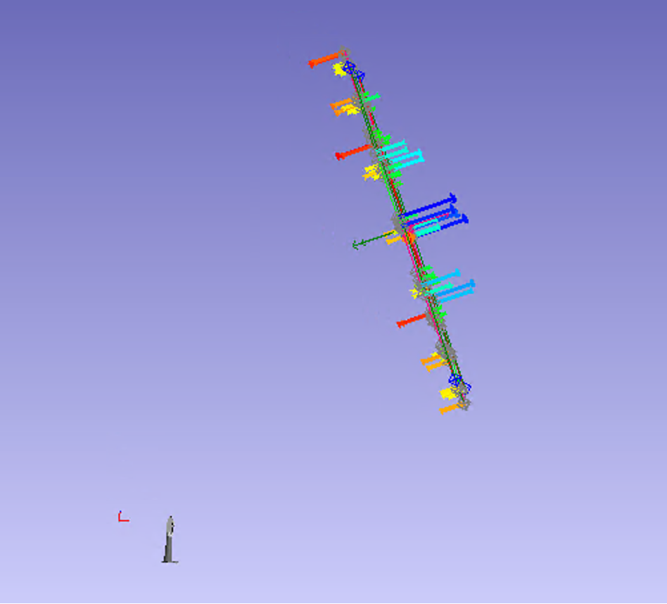

##################
Calibration Screen
##################

Overview
========

The Calibration Screen is part of the Rubin Calibration System, `TSTN-066 <https://tstn-066.lsst.io/>`__.

The Simonyi Calibration Screen is used to reflect light into the camera to produce flat-field calibration images for the Rubin Observatory telescope.

The screen is illuminated by the Flatfield Projector (`TSTN-060 <https://tstn-060.lsst.io/>`__) located at the center of the screen assembly. 
Light from the projector is reflected by the Calibration Reflector (`TSTN-049 <https://tstn-049.lsst.io>`__) onto the calibration screen. 
The telescope collects light from the ~10m wide illuminated screen to generate flat-field images used in camera calibration.

The screen is mounted on the rotating portion of the dome at an azimuth of 233.8 degrees.
When the dome is parked, the TMA can point at it with an Azimuth of -126.2 degrees and Elevation of 23 degrees.

The overall diameter of the screen assembly is 10.27 m. 
The reflective portion of the screen spans radii from 4.18 m to 9.27 m. 
Blackened regions surrounding the reflective section (3.18–4.18 m and 9.27–10.27 m) reduce scattered light.

The screen can rotate between two configurations:

- **Operational position**: inclined 23 degrees from vertical and aligned with the telescope optical axis.
- **Service position**: vertical orientation to allow maintenance access.

In the service position, sufficient clearance exists between the screen and the dome wall to allow a platform lift to access the Flatfield Projector optics and projector electronics cabinet located via the back of the screen.
The screen is expected to remain in the operational configuration for the vast majority of telescope operations.

   Calibration screen, aligned with the TMA.

   Calibration screen, illuminated. Published in NYTimes.

The calibration screen and the structure it is mounted to were designed and partially built by EIE. 
The Rubin engineering group completed the design and installed the screen.

The interface between the Calibration Screen and the dome structure is defined in `LTS-126 <https://docushare.lsst.org/docushare/dsweb/Get/LTS-126>`__.

System requirements
===================
The calibration screen was designed to achieve optical and mechanical requirements
necessary to produce high-quality flat-field calibration images.

.. list-table:: Calibration Screen Requirements
   :header-rows: 1
   :widths: 15 55 30

   * - ID
     - Requirement
     - Addressed In

   * - REQ-FLAT
     - RMS flatness of the reflective optical surface shall not exceed 3 mm
       in the operational inclined position.
     - :ref:`sec-flatness-design`

   * - REQ-GAP
     - Gap between adjacent screen panels shall not exceed 1 mm.
     - :ref:`sec-flatness-design`

   * - REQ-ALIGN
     - Screen shall include alignment reference features allowing the
       telescope laser tracker to determine screen position relative to
       the telescope optical axis.
     - :ref:`sec-telescope-alignment-design`

   * - REQ-REFL
     - Reflective coating shall provide >90% hemispherical reflectance
       over the operational wavelength range; blackened regions shall
       have <6% reflectance to suppress scattered light.
     - :ref:`sec-reflectance-design`

Mechanical Design
=================
The calibration screen assembly consists of three primary subsystems:

1. Steel support structure
2. Aluminum screen structure
3. Reflective panels

The drawings for this system can be found on `Docushare <https://docushare.lsst.org/docushare/dsweb/View/Collection-15387>`__.

Steel Support Structure
-----------------------
The steel support structure mounts the calibration screen to the dome and supports associated instrumentation.
The structure consists of two large steel columns attached to the dome. 
In addition to supporting the calibration screen assembly, the structure also carries the platforms for the Collimated Beam Projector (CBP) and the Laser enclosure.

The original structure was designed by EIE. 
Fabrication was later completed in Coquimbo by Rovial after steel components were sourced from Switzerland and the United States.

During design review it was determined that the initial structure did not adequately support the Collimated Beam Projector (CBP). 
A structural stress analysis was therefore performed and additional support brackets were added.

   CBP and Laser enclosure mounted on one of two steel columns.

Aluminum Screen Structure
-------------------------
The aluminum support structure for the calibration screen was designed and fabricated by EIE.

The structure is assembled from multiple nearly identical aluminum segments that form the circular frame supporting the panels. 
The structure rotates about two pivot points  that will eventually driven by a motorized actuator that moves the screen between the service and operational positions.
The Flatfield Projector sits in the center of the aluminum structure and the projector electronics cabinet is mounted to the back. 

Prior to shipment to Chile, the structure was fully assembled in Italy to verify dimensional accuracy.

   Aluminum structure assembled in Italy prior to shipment.

.. _sec-reflectance-design:

Screen Panels
-------------
The screen surface is composed of 24 individual panels:

* 16 outer panels
* 8 inner panels

These panels were constructed under the guidance of EIE and shipped directly to LabSphere.
The panels are constructed with an aluminum frame, covered with the LabSphere coating on some material (unknown).
The panels were coated by LabSphere using Permaflect coatings:

* Permaflect 94% for the reflective region
* Permaflect 5% for absorptive regions

LabSphere measurements indicate:

* Reflectance greater than 90% for reflective panels
* Absorptive coating reflectance below 5.7%
* Less than 3% RMS variation across panels

   Drawing from LabSphere on the panels.

Each panel attaches to the aluminum structure at four locations using adjustable mounting hardware. 
These adjustment points allow fine control of panel flatness during installation.

   Mechanism for adjusting each panel for flatness.

Design documentation and testing results from LabSphere are available in `Docushare Collection-15387 <https://docushare.lsst.org/docushare/dsweb/View/Collection-15387>`__.

Assembly and Installation
=========================
The aluminum structure was shipped to Chile and assembled outside. 
The mounting holes for the panels were measured using a laser tracker to within specification.
The structure was tarped, waiting for installation.

The steel structure was then installed on the dome.
When that was installed and its location confirmed, the aluminum structure was brought in through the slit.
The aluminum structure was placed in a lifting fixture, which was then raised with a large external crane. 
The aluminum structure was lowered into the dome and set on the 8th floor.
Since the overhead crane could not reach over to the screen location, the aluminum structure was lifted with mounts on the ceiling.

With the aluminum structure in place, the panels were installed. 
This was accomplished by lifting the panels by their adjusters on the back, then slid into place and secured from the back. 

   Aluminum structure drawing, including the lifting fixture. EIE-DWG-46820000A.

Alignment
=========
.. _sec-telescope-alignment-design:

Daily Alignment
---------------
Because the calibration illumination system is optically fast, accurate alignment between the telescope and calibration screen is required.
The standard dome positioning system does not provide sufficient precision for this alignment.

To overcome this limitation, the laser tracker used for daily telescope optical alignment is also used to measure reference retroreflectors mounted on the dome structure. 
These measurements provide an accurate determination of the relative position between the telescope and dome.

   Picture of one of the SMRs attached to the calibration screen.

The laser tracker mounted at the center of the TMA cannot directly view the calibration screen. 
Instead, the aluminum structure includes four radial extensions where spherical mounted retroreflectors (SMRs) are installed.
The original extensions were found to be too short to allow reliable visibility from the tracker location, so additional extension pieces were added and SMRs mounted at their ends.

The screen must be approximately aligned before the laser tracker can acquire and lock onto the four SMRs. 
Once these measurements are obtained, the TMA is moved to achieve the required alignment between the telescope optical axis and the calibration screen.

Laser Tracker Software
----------------------
In order to measure the exact location of the calibration screen, the laser tracker is used.
This requires use of the Spatial Analyzer software, which can be accessed via remote desktop at `lasertracker-vm.cp.lsst.org`.

A program was written by Spatial Analyzer that allows us to send commands to it through our scripts. 
In this case, we use the `lasertracker/align.py` script with the target "CALIBRATION_SCREEN". 

.. _sec-flatness-design:

Flatness measurements
---------------------
Once all panels were installed, they flatness of the screen was measured, which was done using a Leica laser tracker (not the one installed on the TMA).
An operator placed an SMR against the screen at each panel adjustment location. 
After measurements were collected, several panels were adjusted until the surface met the 3 mm RMS flatness requirement, with the screen in a vertical orientation.
This initial measurement also guaranteed the 1mm separation between panels.

   Numbering of the panels used to measure the flatness of the screen. 
   In the four green boxes are the locations of the SMRs, which jut out from the screen so they can be seen by the Laser Tracker.
   The numbers identify each of the adjusters on the backside of the panels.

This measurement was repeated 1 year after installation with the screen in the operational position. 
It was found that the flatness exceeded the 3mm RMS value, with a measurement of 5.77 mm RMS.
The screen is clearly pulled by the pivot points, bending the screen into a potato chip shape.
It has not been decided yet whether or not to adjust the panels.

   Measurement of the flatness screen using the Leica laser tracker. 
   It's clear there is some bending (like a potato chip) in the screen as it is pulled by the pivot points.
   The RMS for this measurement was 5.77 mm.

